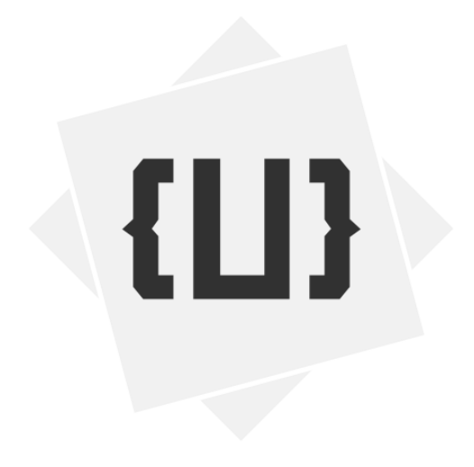

# UDH Christmas Event 2018
## What is it?
UDC (Unity Developer Community) is an online Unity development discord built to connect game developers. This is our Christmas event for 2018 which features programming and language challenges.

There are a few separate projects that combine to make the experience, there is a Java based discord bot, a server compiling the code and the website which the users find.

## Where can I find the website?
[Here](http://christmas.unitydeveloperhub.com/) or [here](https://darkzek.github.io/UDC-Christmas-Event/Website/index.html) or [here](http://207.154.234.81/)

## Can I contribute a challenge?
Sure! As long as you submit it before the first of January which is when the event ends, your idea can be incorporated into the event
